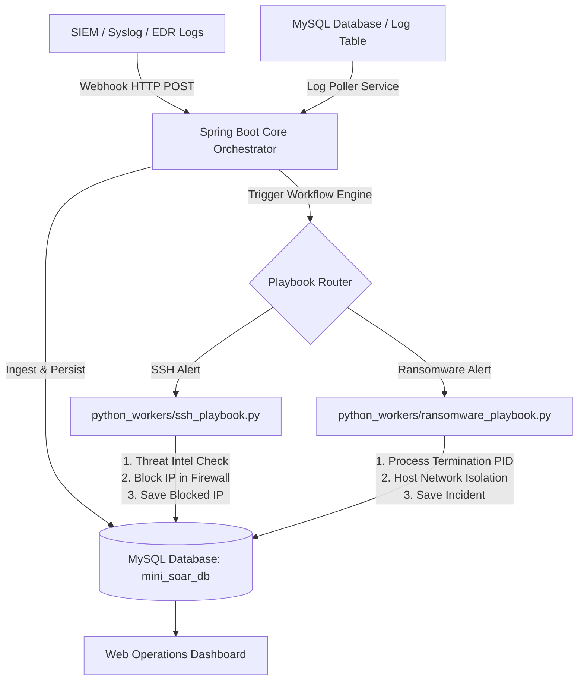

# Mini-SOAR Security Automation Platform

Hệ thống **Mini-SOAR (Security Orchestration, Automation, and Response)** đơn giản hóa, lấy cảm hứng từ [Shuffle SOAR](https://github.com/shuffle/shuffle), tối ưu hóa cho **MySQL Database**, được xây dựng chủ đạo bằng **Java (Spring Boot)** và **Python (Automation Playbook Workers)**.

Hệ thống tập trung tự động hóa xử lý 2 luồng nghiệp vụ an ninh mạng trọng yếu:
1. **Xử lý cảnh báo tấn công SSH (SSH Brute-force & Unauthorized Access)**: Tự động đánh giá IP Reputation, chặn IP bằng Firewall rules / MySQL Blacklist, gửi thông báo sự cố.
2. **Xử lý cảnh báo Ransomware (Mã độc mã hóa dữ liệu)**: Tự động đánh giá mức độ nguy hiểm (IOC), tiêu diệt tiến trình mã độc (Kill PID), cô lập máy tính khỏi mạng (Host Network Isolation) và tạo ticket ứng cứu khẩn cấp cho SOC.

## 📚 Bộ Tài liệu Dự án Chi tiết (Project Documentation)

Hệ thống được đóng gói đầy đủ bộ 4 tài liệu chuyên ngành chuẩn mực tại thư mục [`docs/`](file:///home/pnreal/Mini-SOAR-Security-Automation/docs/):

1. 🏗️ [**Tài liệu Kiến trúc Hệ thống (ARCHITECTURE.md)**](file:///home/pnreal/Mini-SOAR-Security-Automation/docs/ARCHITECTURE.md): Sơ đồ Mermaid High-Level Architecture, Sequence Diagram chu trình xử lý sự cố và phân rã các thành phần Java & Python.
2. 🔌 [**Đặc tả API & Tích hợp Webhook (API_SPECIFICATION.md)**](file:///home/pnreal/Mini-SOAR-Security-Automation/docs/API_SPECIFICATION.md): Hướng dẫn chi tiết định dạng JSON Webhook API cho các hệ thống SIEM/EDR, mã lỗi HTTP và câu lệnh `curl` mẫu.
3. 🛡️ [**Quy trình Playbook & Runbook (PLAYBOOKS_RUNBOOK.md)**](file:///home/pnreal/Mini-SOAR-Security-Automation/docs/PLAYBOOKS_RUNBOOK.md): Thuật toán chấm điểm nguy cơ IP Reputation, lệnh chặn Firewall `iptables DROP` và quy trình khoanh vùng diệt tiến trình Ransomware.
4. 🗄️ [**Thiết kế CSDL MySQL & ERD (DATABASE_SCHEMA.md)**](file:///home/pnreal/Mini-SOAR-Security-Automation/docs/DATABASE_SCHEMA.md): Sơ đồ quan hệ ERD, cấu trúc chi tiết các bảng `alerts`, `workflow_executions`, `blocked_ips`, `ransomware_incidents` và chính sách Log Retention.

---

## 🏗️ Kiến trúc Hệ thống (Architecture)



### Các thành phần chính:
- **Core Orchestrator (Java 21 / Spring Boot 3)**:
  - **REST Webhook Ingestion Controllers**: Tiếp nhận HTTP POST JSON alert từ các hệ thống SIEM/EDR.
  - **Workflow Engine Service**: Quản lý trạng thái thực thi (Pending, In Progress, Completed, Failed), điều phối gọi Python Workers.
  - **Log Poller Scheduler**: Quét bảng `alerts` trong MySQL định kỳ để xử lý các cảnh báo mới.
  - **Dashboard APIs**: Cung cấp API báo cáo tổng quan.
- **Automation Workers (Python 3)**:
  - `python_workers/ssh_playbook.py`: Phân tích IP, chấm điểm nguy cơ, tự động tạo quy tắc chặn IP trên Firewall/Database.
  - `python_workers/ransomware_playbook.py`: Phân tích IOC tiến trình, dừng PID mã độc, giả lập cô lập mạng mạng máy chủ.
- **Database Layer (MySQL 8.0)**:
  - Bảng `alerts`: Lưu trữ tất cả cảnh báo SSH & Ransomware.
  - Bảng `workflow_executions`: Nhật ký lịch sử thực thi Playbook chi tiết (steps log, runtime ms).
  - Bảng `blocked_ips`: Danh sách các IP bị chặn do tấn công SSH.
  - Bảng `ransomware_incidents`: Nhật ký ứng cứu sự cố mã độc Ransomware.
- **Web Dashboard (HTML5 / Bootstrap 5 / JS)**:
  - Giao diện trực quan tích hợp tại `http://localhost:8080` xem danh sách alert, execution logs, danh sách IP bị chặn và công cụ giả lập cảnh báo.

---

## 📋 Yêu cầu môi trường (Prerequisites)

- **Java JDK**: 21+
- **Python**: 3.10+
- **Apache Maven**: 3.8+
- **Database**: MySQL Server 8.0 (hoặc Docker để chạy MySQL container)

---

## 🚀 Hướng dẫn Chạy Hệ thống (Quick Start)

### Phương án 1: Sử dụng Script tự động `run.sh`

```bash
# Cấp quyền thực thi và khởi chạy
chmod +x run.sh
./run.sh
```

Script sẽ tự động:
1. Bật container MySQL 8.0 bằng Docker Compose.
2. Build ứng dụng Spring Boot bằng Maven (`mvn clean package -DskipTests`).
3. Chạy ứng dụng tại port `8080`.

---

### Phương án 2: Chạy thủ công

#### 1. Khởi tạo MySQL Database

Chạy container MySQL bằng Docker Compose:
```bash
docker compose up -d
```
Hoặc import file `schema.sql` vào MySQL cục bộ:
```bash
mysql -u root -p < schema.sql
```

#### 2. Cấu hình `application.yml` (nếu cần đổi thông số kết nối MySQL)
File `src/main/resources/application.yml`:
```yaml
spring:
  datasource:
    url: jdbc:mysql://localhost:3306/mini_soar_db?createDatabaseIfNotExist=true&useSSL=false
    username: soaruser
    password: soarpassword
```

#### 3. Build & Run Java Application

```bash
mvn clean package -DskipTests
java -jar target/mini-soar-security-automation-1.0.0.jar
```

Truy cập Web Dashboard tại: **`http://localhost:8080`**

---

## 🔌 ReST API & Webhook Ingestion Documentation

### 1. Ingest SSH Alert Webhook
- **Endpoint**: `POST /api/v1/alerts/ssh`
- **Content-Type**: `application.json`
- **Sample Payload**:
```json
{
  "sourceIp": "198.51.100.44",
  "hostname": "srv-prod-ssh01",
  "username": "root",
  "failedAttempts": 6,
  "description": "Multiple failed SSH login attempts detected from public IP"
}
```

### 2. Ingest Ransomware Alert Webhook
- **Endpoint**: `POST /api/v1/alerts/ransomware`
- **Content-Type**: `application.json`
- **Sample Payload**:
```json
{
  "hostname": "ws-finance-dept04",
  "processName": "vssadmin.exe",
  "pid": 4812,
  "suspiciousExtensions": [".locked", ".crypto"],
  "affectedFileCount": 145,
  "description": "Suspicious shadow copy deletion and mass encryption detected"
}
```

### 3. Các API Quản trị & Báo cáo
- `GET /api/v1/alerts` : Lấy danh sách tất cả cảnh báo.
- `GET /api/v1/executions` : Lấy lịch sử thực thi tất cả Playbooks.
- `GET /api/v1/executions/alert/{alertId}` : Lấy log thực thi chi tiết của alert cụ thể.
- `GET /api/v1/actions/blocked-ips` : Lấy danh sách IP đã bị chặn.
- `GET /api/v1/actions/ransomware-incidents` : Lấy danh sách máy tính đã bị cô lập do Ransomware.
- `GET /api/v1/dashboard/summary` : Lấy chỉ số tổng quan hệ thống.

---

## 📊 Giao diện Web Dashboard

Dashboard tích hợp sẵn giao diện trực quan hỗ trợ:
- Xem tổng số alert, số lượng SSH attacks, Ransomware detections, IP đã chặn.
- Giả lập bắn Webhook Alert SSH và Ransomware chỉ với 1 click button.
- Xem trực tiếp Log Output dạng JSON chi tiết theo từng bước thực thi của Python Playbook Worker.
