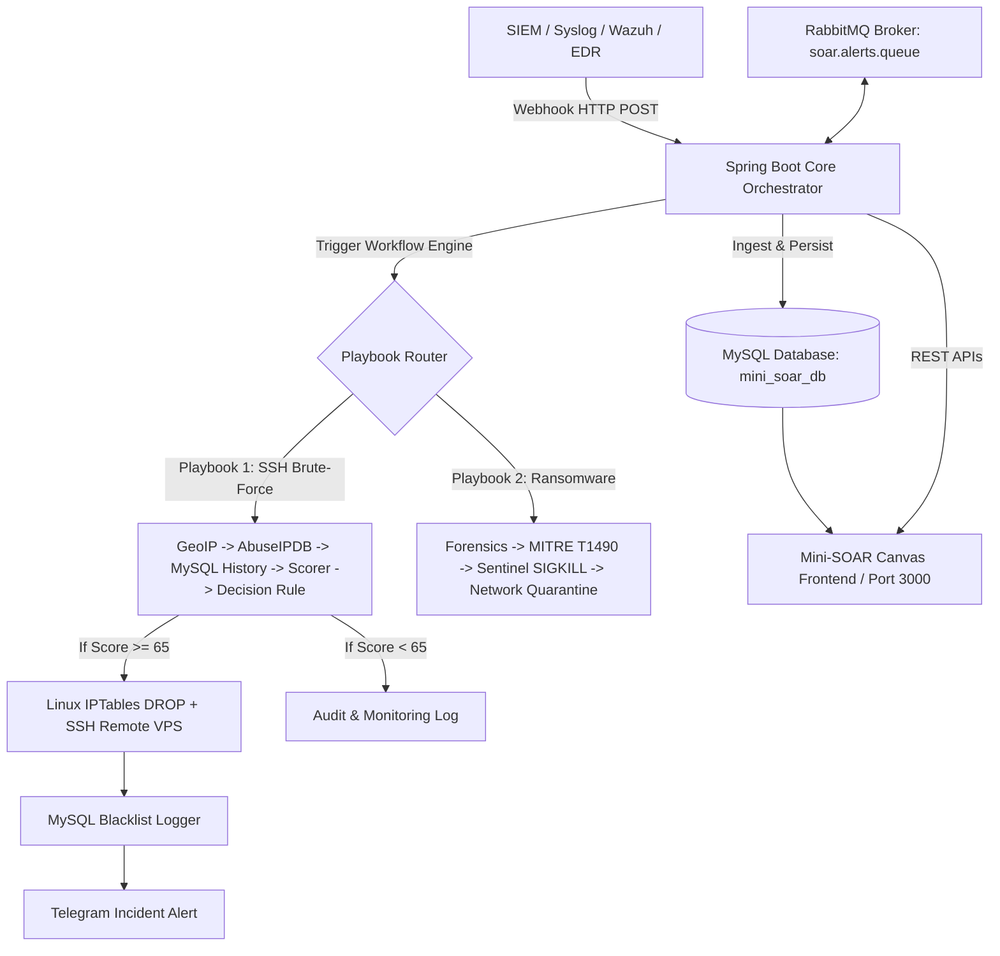

# Mini-SOAR Security Automation Platform

Hệ thống **Mini-SOAR (Security Orchestration, Automation, and Response)** hiện đại, tối ưu hóa cho **MySQL Database**, được xây dựng với kiến trúc module hóa: **Backend (Java Spring Boot 3 + Python Automation Workers)** và **Frontend (Giao diện đồ họa Canvas Workflow tương tác thời gian thực)**.

Hệ thống tập trung tự động hóa xử lý 2 luồng nghiệp vụ an ninh mạng trọng yếu:
1. **Xử lý cảnh báo tấn công SSH (SSH Brute-force Auto-Response)**: Tự động tra cứu GeoIP, kiểm tra danh tiếng IP trên AbuseIPDB, kiểm tra tiền sử vi phạm trong MySQL Blacklist, tính điểm rủi ro động (Dynamic Risk Scoring), rẽ nhánh điều kiện (Decision Rule), chặn IP bằng Linux IPTables cục bộ hoặc bắn lệnh SSH qua Remote VPS, ghi log MySQL và gửi thông báo cảnh báo qua Telegram.
2. **Xử lý cảnh báo Ransomware (Ransomware Emergency Containment)**: Thu thập chứng cứ tiến trình qua `/proc`, phân tích kỹ thuật MITRE ATT&CK (T1490 - Inhibit System Recovery), tiêu diệt cây tiến trình mã độc (SIGKILL), cô lập card mạng máy tính (Host Network Isolation), ghi nhận sự cố và phát cảnh báo khẩn cấp cho SOC.

---

## 🎨 Giao diện & Kiến trúc Workflow Canvas (Workflow Studio)

Hệ thống sở hữu trình thiết kế quy trình đồ họa trực quan (Interactive Node-based Canvas Studio) với đầy đủ các tính năng:
- **Kéo thả & Nối dây (Drag & Drop, Port Connections)**: Hỗ trợ kết nối cổng Output thông thường hoặc cổng rẽ nhánh điều kiện **TRUE (Xanh)** / **FALSE (Đỏ)**.
- **Duyệt đồ thị động (Condition-Aware Graph Traversal)**: Khi chạy mô phỏng hoặc thực thi thật, hệ thống tự động kiểm tra điều kiện rẽ nhánh:
  - Nếu `Score >= 65` (TRUE): Luồng kích hoạt nhánh chặn IP (IPTables / SSH Remote VPS), làm mờ các node giám sát.
  - Nếu `Score < 65` (FALSE): Luồng chỉ đi vào nhánh Audit & Monitoring Log, các node chặn nguy hiểm sẽ tự động bị bỏ qua (`SKIPPED`).
- **Trình Test Node Độc Lập (Single Node Studio)**: Cho phép chạy thử từng Node riêng lẻ với dữ liệu mẫu hoặc dữ liệu từ node upstream trước khi kích hoạt toàn bộ playbook.
- **Hỗ trợ SSH Remote VPS Connector**: Tích hợp module JSch SSH Native Client để kết nối và thực thi lệnh trực tiếp trên các máy chủ / VPS Linux từ xa.

---

## 📚 Bộ Tài liệu Dự án Chi tiết (Project Documentation)

Hệ thống được đóng gói đầy đủ bộ tài liệu chuyên ngành chuẩn mực tại thư mục [`docs/`](docs/):

1. 🏗️ [**Tài liệu Kiến trúc Hệ thống (ARCHITECTURE.md)**](docs/ARCHITECTURE.md): Sơ đồ Mermaid High-Level Architecture, Sequence Diagram chu trình xử lý sự cố và phân rã các thành phần Java & Python.
2. 🔌 [**Đặc tả API & Tích hợp Webhook (API_SPECIFICATION.md)**](docs/API_SPECIFICATION.md): Hướng dẫn chi tiết định dạng JSON Webhook API cho các hệ thống SIEM/EDR, mã lỗi HTTP và câu lệnh `curl` mẫu.
3. 🛡️ [**Quy trình Playbook & Runbook (PLAYBOOKS_RUNBOOK.md)**](docs/PLAYBOOKS_RUNBOOK.md): Thuật toán chấm điểm nguy cơ IP Reputation, lệnh chặn Firewall `iptables DROP` và quy trình khoanh vùng diệt tiến trình Ransomware.
4. 🗄️ [**Thiết kế CSDL MySQL & ERD (DATABASE_SCHEMA.md)**](docs/DATABASE_SCHEMA.md): Sơ đồ quan hệ ERD, cấu trúc chi tiết các bảng `alerts`, `workflow_executions`, `blocked_ips`, `ransomware_incidents` và chính sách Log Retention.

---

## 🏗️ Kiến trúc Hệ thống (Architecture)



### Các thành phần chính:
- **Backend (Java 21 / Spring Boot 3)** (`backend/`):
  - **REST Webhook Ingestion Controllers**: Tiếp nhận HTTP POST JSON alert từ các hệ thống SIEM/EDR/Wazuh.
  - **RemoteSshExecutionService**: Module thực thi lệnh SSH từ xa qua thư viện JSch Java Native và fallback OpenSSH CLI.
  - **Workflow Engine Service & Playbook Controller**: Quản lý trạng thái thực thi (Pending, Running, Completed, Failed), điều phối đồ thị nodes và branches.
  - **Log Poller Scheduler & RabbitMQ Integration**: Nhận và xử lý hàng đợi sự cố thời gian thực.
  - **Security Action Controller**: API thực hiện chặn IP, mở chặn (Unblock), thực thi SSH từ xa và tra cứu lịch sử vi phạm.
- **Automation Workers (Python 3)** (`backend/python_workers/`):
  - `ssh_playbook.py`: Phân tích IP, chấm điểm nguy cơ, tự động tạo quy tắc chặn IP trên Firewall/Database.
  - `ransomware_playbook.py`: Phân tích IOC tiến trình, dừng PID mã độc, giả lập cô lập mạng máy chủ.
- **Database Layer (MySQL 8.0)**:
  - Bảng `alerts`: Lưu trữ tất cả cảnh báo SSH & Ransomware.
  - Bảng `workflow_executions`: Nhật ký lịch sử thực thi Playbook chi tiết (steps log, runtime ms).
  - Bảng `blocked_ips`: Danh sách các IP bị chặn do tấn công SSH.
  - Bảng `ransomware_incidents`: Nhật ký ứng cứu sự cố mã độc Ransomware.
- **Frontend (Vanilla HTML5 / Modern CSS / Vanilla JS Canvas Engine)** (`frontend/`):
  - Giao diện thiết kế đồ họa trực quan tại `http://localhost:3000` chạy qua Nginx web server, hỗ trợ kéo thả các App trong danh mục, cấu hình tham số trực tiếp và chạy thử nghiệm (Test Node / Run Simulation).

---

## 📋 Yêu cầu môi trường (Prerequisites)

- **Docker & Docker Compose** (Khuyên dùng)
- Hoặc chạy thủ công:
  - **Java JDK**: 21+
  - **Python**: 3.10+
  - **Apache Maven**: 3.8+
  - **Database**: MySQL Server 8.0 & RabbitMQ 3.x

---

## 🚀 Hướng dẫn Chạy Hệ thống (Quick Start)

### Phương án 1: Khởi chạy toàn bộ hệ thống bằng Docker Compose (Khuyên dùng)

```bash
docker compose up -d --build
```
Hệ thống sẽ khởi chạy đồng bộ:
- **MySQL Database**: `localhost:3306` (User: `soaruser`, Database: `mini_soar_db`)
- **RabbitMQ Message Broker**: `localhost:5672` (Management Dashboard: `http://localhost:15672`)
- **Mini-SOAR Backend**: `http://localhost:8080`
- **Mini-SOAR Frontend**: `http://localhost:3000`

---

### Phương án 2: Chạy độc lập từng phần

#### 1. Khởi động CSDL & Message Queue
```bash
docker compose up -d mysql-db rabbitmq
```

#### 2. Khởi chạy Backend (Java Spring Boot)
```bash
./run.sh
# Hoặc thủ công:
mvn -f backend/pom.xml clean package -DskipTests
java -jar backend/target/mini-soar-security-automation-1.0.0.jar
```

#### 3. Khởi chạy Frontend
Frontend sử dụng Nginx tĩnh:
```bash
docker compose up -d soar-frontend
```
Truy cập giao diện tại: **`http://localhost:3000`**

---

## 🔌 ReST API & Webhook Ingestion Documentation

Chi tiết toàn bộ đặc tả API xem tại [docs/API_SPECIFICATION.md](docs/API_SPECIFICATION.md).

### 1. Ingest SSH Alert Webhook
- **Endpoint**: `POST /api/v1/alerts/ssh`
- **Sample Payload**:
```json
{
  "sourceIp": "198.51.100.44",
  "hostname": "srv-prod-ssh01",
  "username": "root",
  "failedAttempts": 6,
  "description": "Multiple failed SSH login attempts detected from public IP"
}
```

### 2. Ingest Ransomware Alert Webhook
- **Endpoint**: `POST /api/v1/alerts/ransomware`
- **Sample Payload**:
```json
{
  "hostname": "ws-finance-dept04",
  "processName": "vssadmin.exe",
  "pid": 4812,
  "suspiciousExtensions": [".locked", ".crypto"],
  "affectedFileCount": 145,
  "description": "Suspicious shadow copy deletion and mass encryption detected"
}
```

### 3. Remote SSH VPS Execution API
- **Endpoint**: `POST /api/v1/actions/remote-ssh/execute`
- **Sample Payload**:
```json
{
  "host": "104.43.88.77",
  "username": "root",
  "port": 22,
  "command": "iptables -A INPUT -s 198.51.100.45 -p tcp --dport 22 -j DROP",
  "timeout_seconds": 10
}
```

### 4. Các API Quản trị & Báo cáo
- `GET /api/v1/alerts` : Lấy danh sách tất cả cảnh báo.
- `GET /api/v1/executions` : Lấy lịch sử thực thi tất cả Playbooks.
- `GET /api/v1/actions/blocked-ips` : Lấy danh sách IP đã bị chặn.
- `DELETE /api/v1/actions/blocked-ips/{id}` : Mở chặn (Unblock) IP.
- `GET /api/v1/actions/ransomware-incidents` : Lấy danh sách máy tính đã bị cô lập.
- `GET /api/v1/dashboard/summary` : Lấy thống kê tổng quan hệ thống.
