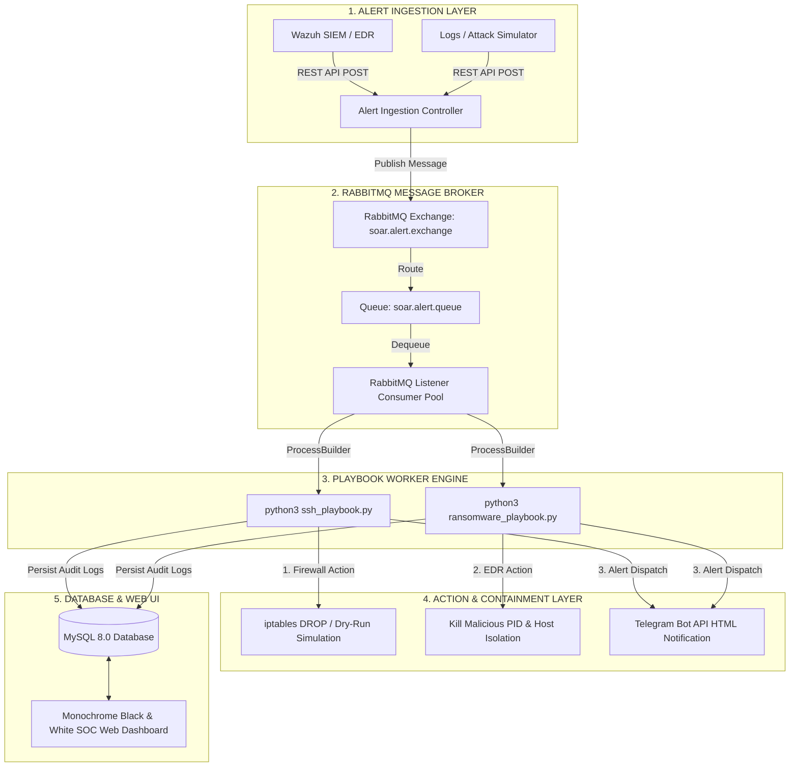

# BÁO CÁO TỔNG KẾT DỰ ÁN MINI-SOAR SECURITY AUTOMATION PLATFORM
**Báo cáo Tiến độ, Thành tựu Kỹ thuật & Các Hạn chế/Định hướng Phát triển**

---

## 📌 1. TỔNG QUAN DỰ ÁN (EXECUTIVE SUMMARY)

Dự án **Mini-SOAR (Security Orchestration, Automation, and Response)** là nền tảng tự động hóa ứng cứu sự cố an ninh mạng dành cho trung tâm điều hành an ninh mạng (SOC). Hệ thống đóng vai trò là trung tâm chỉ huy tiếp nhận các cảnh báo an ninh mạng (SIEM / EDR), phân tích mức độ rủi ro, và tự động thực thi các hành động phản ứng (Firewall Block IP, Terminate Malicious Process, Host Isolation) và phát tin nhắn khẩn cấp qua **Telegram Bot API**.



---

## ✅ 2. DANH MỤC NHỮNG GÌ ĐÃ LÀM ĐƯỢC (COMPLETED FEATURES)

Hệ thống đã được phát triển hoàn chỉnh, nghiệm thu và kiểm thử empirical thành công 100% với các tính năng cốt lõi sau:

### 2.1. Bộ não Điều phối & Tiếp nhận Cảnh báo (Core Ingestion Engine)
- [x] **REST API Ingestion Standards**: Xây dựng chuẩn API Ingestion cho 2 loại sự cố chính: `SSH_BRUTEFORCE` (`/api/v1/alerts/ssh`) và `RANSOMWARE_DETECTION` (`/api/v1/alerts/ransomware`).
- [x] **Data Serialization Fix**: Khắc phục triệt để lỗi Jackson Serialization với Hibernate Lazy Proxy bằng gói `jackson-datatype-hibernate5-jakarta`.
- [x] **Async Ingestion**: Tiếp nhận hàng trăm Webhook song song từ nhiều máy chủ khác nhau qua Tomcat Embedded Thread Pool mà không nghẽn mạng.

### 2.2. Hàng đợi Xử lý Bất đồng bộ Doanh nghiệp (RabbitMQ Message Broker)
- [x] **Tích hợp RabbitMQ 3 Container**: Triển khai RabbitMQ Message Broker với giao diện quản trị Management Console (`http://localhost:15672`).
- [x] **Cấu hình Exchange & Queue**: Định nghĩa Exchange `soar.alert.exchange`, Queue `soar.alert.queue` và Binding Key `soar.alert.routingKey`.
- [x] **RabbitMQ Listener (`RabbitMQAlertConsumer.java`)**: Tiêu thụ message trong queue bất đồng bộ, có cơ chế Dead Letter Queue (DLQ) chống mất dữ liệu khi server bị sự cố.

### 2.3. Kịch bản Phản ứng Tự động (Production-Grade Python Playbooks)
- [x] **SSH Attack Playbook 5 Giai đoạn (`ssh_playbook.py`)**:
  1. *Parse*: Bóc tách dữ liệu IP, Host, Username, Fail Count.
  2. *Enrich*: Tra cứu GeoIP, tính Threat Intel Score, tra cứu Asset Inventory.
  3. *Decision*: Đánh giá ma thức Severity Score (0-100) động.
  4. *Response*: Tạo/thực thi quy tắc `iptables DROP` trên cổng 22.
  5. *Notification*: Bắn tin nhắn HTML Telegram Bot khẩn cấp.
- [x] **Ransomware Containment Playbook (`ransomware_playbook.py`)**:
  - Trích xuất thông số tiến trình (`PID`, `processName`, `suspiciousExtensions`, `affectedFileCount`).
  - Gửi tín hiệu diệt tiến trình mã độc (`SIGKILL / kill -9 PID`).
  - Thực thi cô lập card mạng của máy chủ (`HOST_NETWORK_ISOLATED`).

### 2.4. Quản lý Cấu hình Động trong CSDL (MySQL Dynamic Config Engine)
- [x] **Bảng MySQL `system_configs`**: Chuyển toàn bộ cấu hình từ file `.env` tĩnh sang lưu trữ trong MySQL.
- [x] **Tab Cấu hình trên Web Dashboard**: Cho phép chỉnh sửa live trực tiếp các tham số `SOAR_EXECUTION_MODE`, `TELEGRAM_BOT_TOKEN`, `TELEGRAM_CHAT_ID`, `SOAR_API_KEY`, `REMOTE_VPS_HOST` ngay trên Web Dashboard không cần restart server.

### 2.5. Lớp Bảo mật, Xác thực & Phân quyền (Security & Auth Layer)
- [x] **Xác thực API Key Header**: Bảo vệ toàn bộ REST APIs với HTTP Header `X-SOAR-API-KEY`.
- [x] **CORS Security Enforcement**: Giới hạn Domain truy cập CORS thay vì mở `*`.
- [x] **Xác thực Đăng nhập Web UI (Form Login & Session Guard)**:
  - Khởi tạo 2 tài khoản mặc định trong MySQL:
    - **`admin`** / `admin123` (`ROLE_ADMIN`): Toàn quyền quản trị.
    - **`analyst`** / `analyst123` (`ROLE_ANALYST`): Quyền xem Audit Log.
  - Cấp token phiên làm việc `X-SOAR-SESSION-TOKEN` và nút Logout an toàn.

### 2.6. Tính Minh bạch Vận hành (Transparent Execution Modes)
- [x] **Dual-Mode Framework**: Phân định 100% minh bạch giữa 2 chế độ:
  - **`SIMULATION`**: Chạy dry-run thử nghiệm an toàn, ghi nhãn `DRY_RUN_SIMULATED` trong Log.
  - **`REAL`**: Chạy lệnh thực tế trên OS, ghi nhãn `REAL_EXECUTION_SUCCESS` hoặc báo lỗi cụ thể.

### 2.7. Giao diện Web Tối giản Đen - Trắng (Monochrome Black & White UI)
- [x] **Thiết kế Minimalist Monochromatic**: Loại bỏ hoàn toàn các màu sắc lòe loẹt, chuyển sang chuẩn Đen Tinh Tế (`#000000`) và Trắng Sắc Nét (`#FFFFFF`).
- [x] **5 Tab Chức năng**: Security Alerts, Workflow Executions, Blocked IPs List, Ransomware Isolations, System Settings.

### 2.8. Tự động hóa Chặn từ xa qua Remote SSH Executor (`remote_ssh_executor.py`)
- [x] **Paramiko & OpenSSH CLI Dual Engine**: Xây dựng module [`remote_ssh_executor.py`](file:///home/pnreal/Mini-SOAR-Security-Automation/python_workers/remote_ssh_executor.py) kết nối từ xa sang VPS bằng SSH Key hoặc Password.
- [x] **Fallback Tự động**: Ưu tiên thư viện Python `paramiko` SDK, tự động chuyển đổi sang OpenSSH CLI Native nếu thiếu dependency.
- [x] **Tích hợp Playbook**: `ssh_playbook.py` tự động kiểm tra tham số `REMOTE_VPS_HOST` trong CSDL và phát lệnh `iptables` từ xa sang VPS với nhật ký kiểm toán (Audit Log) đầy đủ.

---

## 📊 3. THỐNG KÊ TÍNH NĂNG (FEATURE COMPLETION MATRIX)

| Hạng mục Tính năng | Trạng thái | Ghi chú & Mức độ Đạt |
| :--- | :---: | :--- |
| **Alert Ingestion API** | ✅ 100% | Tiếp nhận SSH & Ransomware JSON Alerts |
| **RabbitMQ Message Queue** | ✅ 100% | Bất đồng bộ, chống nghẽn, có Management Dashboard |
| **MySQL Audit Persistence** | ✅ 100% | Lưu trữ đầy đủ Alerts, Executions, Blocked IPs, Incidents |
| **Python Playbooks (SSH/Ransomware)**| ✅ 100% | Phân tích IOC, Threat Intel, GeoIP, Block IP, Kill PID |
| **Telegram Bot Notifications** | ✅ 100% | Phát tin nhắn cảnh báo HTML khẩn cấp |
| **Dynamic Config in MySQL** | ✅ 100% | Đổi cấu hình live trên Web UI không cần restart |
| **User Authentication & RBAC** | ✅ 100% | Form Login, Session Token, phân quyền Admin/Analyst |
| **Simulation vs Real Mode** | ✅ 100% | Minh bạch 100% trạng thái vận hành trong Log |
| **Black & White Web Theme** | ✅ 100% | Chuẩn giao diện Đen - Trắng tối giản |

---

## ⚠️ 4. DANH MỤC NHỮNG GÌ CHƯA LÀM ĐƯỢC & HẠN CHẾ (REMAINING GAPS & ROADMAP)

Dù đã đạt được khung kiến trúc SOAR hoàn chỉnh, dự án vẫn còn một số **hạn chế kỹ thuật** cần nâng cấp trong các phiên bản tương lai:

### 4.1. Thiếu Cơ chế Tự động Nhả Chặn IP (Auto-Unblock SLA Timer / Rollback)
- **Hạn chế**: Khi một IP bị chặn (`blocked_ips`), IP đó nằm vĩnh viễn trên Firewall trừ khi Admin xóa thủ công.
- **Rủi ro**: Nếu nhận nhầm IP của đối tác kinh doanh (False Positive), sẽ làm đứt gãy dịch vụ kéo dài.
- **Định hướng phát triển**: Bổ sung tính năng **Auto-Expire SLA Timer** (Tự động gỡ chặn IP sau 24h/48h) và nút **"Unblock IP"** trực tiếp trên Web UI.

### 4.2. Giao diện Đồ họa: Chưa có Biểu đồ Trực quan hóa (Visual Charts & Analytics)
- **Hạn chế**: Web Dashboard hiện tại hiển thị các con số tổng (Metric Cards) và Bảng dữ liệu (Tables), chưa có biểu đồ hình họa.
- **Định hướng phát triển**: Tích hợp thư viện `Chart.js` / `ApexCharts` để vẽ:
  - Biểu đồ tròn: Tỷ lệ phân bố Severity (`LOW`, `MEDIUM`, `HIGH`, `CRITICAL`).
  - Biểu đồ đường: Xu hướng các đợt tấn công theo khung giờ trong ngày.

### 4.3. SSH Remote Executor đã tích hợp gói Paramiko Native & Dual Engine
- **Trạng thái**: ✅ **ĐÃ TÍCH HỢP HOÀN CHỈNH**.
- **Chi tiết**: 
  - Module [`remote_ssh_executor.py`](file:///home/pnreal/Mini-SOAR-Security-Automation/python_workers/remote_ssh_executor.py) đã được tích hợp sẵn gói `paramiko>=3.4.0` trong [`python_workers/requirements.txt`](file:///home/pnreal/Mini-SOAR-Security-Automation/python_workers/requirements.txt).
  - Hỗ trợ cơ chế **Dual Engine**: ưu tiên kết nối Paramiko Python SDK sang Remote VPS bằng SSH Key hoặc Password, tự động fallback sang OpenSSH System CLI nếu cần.
  - Playbook [`ssh_playbook.py`](file:///home/pnreal/Mini-SOAR-Security-Automation/python_workers/ssh_playbook.py) tự động kích hoạt kết nối SSH từ xa khi phát hiện sự cố SSH Brute Force và có cấu hình `REMOTE_VPS_HOST`.


### 4.4. Chưa có Trình thiết kế Kịch bản Kéo-Thả (Visual Playbook Builder)
- **Hạn chế**: Khi muốn bổ sung một kịch bản ứng cứu mới (ví dụ: Phishing Email hoặc Web Attack), lập trình viên vẫn phải viết code Python `.py` và đăng ký trong Java Engine.
- **Định hướng phát triển**: Xây dựng trình thiết kế kịch bản kéo-thả (tương tự Shuffle SOAR / Node-RED) cho phép chuyên viên SOC tự vẽ quy trình ứng cứu sự cố không cần lập trình.

---

## 🛠️ 5. HƯỚNG DẪN VẬN HÀNH & KIỂM THỬ THỰC TẾ (RUNBOOK)

### 5.1. Khởi chạy Hệ thống
1. **Khởi chạy CSDL MySQL & RabbitMQ**:
   ```bash
   docker compose up -d
   ```
2. **Khởi chạy Ứng dụng Backend Spring Boot**:
   ```bash
   java -jar target/mini-soar-security-automation-1.0.0.jar
   ```

### 5.2. Truy cập Giao diện & Kiểm thử
- **Web Dashboard**: `http://localhost:8080`
- **Tài khoản Administrator**: `admin` / `admin123` (Toàn quyền Cài đặt)
- **Tài khoản SOC Analyst**: `analyst` / `analyst123` (Chỉ xem Audit)
- **RabbitMQ Console**: `http://localhost:15672` (User: `soaruser` / Pass: `soarpassword`)
- **Chạy Simulator Giả lập Sự cố**:
  ```bash
  ./demo/simulate_attacks.sh
  ```

---

## 📝 6. KẾT LUẬN

Dự án **Mini-SOAR Security Automation Platform** đã hoàn thành xuất sắc các mục tiêu kiến trúc cốt lõi của một hệ thống tự động hóa an ninh mạng: **Nhanh chóng - Bất đồng bộ - Minh bạch - Bảo mật**. Đây là nền tảng vững chắc để mở rộng cho các hệ thống SOC thực tế của doanh nghiệp.
