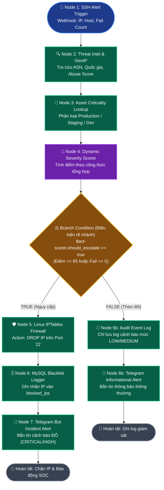
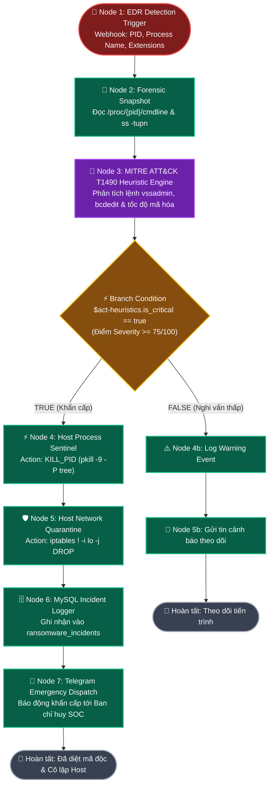

# 🛡️ KIẾN TRÚC WORKFLOW & TÀI LIỆU CẤU HÌNH APPS (INPUT / OUTPUT) - MINI-SOAR

Tài liệu này cung cấp toàn bộ sơ đồ trực quan (Mermaid Flowchart) của **2 Playbook bảo mật**, cơ chế hoạt động chi tiết của **Node Đánh Giá Điểm & Ra Quyết Định (Scoring & Decision Node)** và đặc tả chi tiết danh sách **5 Org Apps** cần tạo trong mục **My Apps / Org Apps**.

---

## 📑 MỤC LỤC
1. [Cơ chế Node Đánh Giá Điểm & Ra Quyết Định (Scoring Engine)](#1-cơ-chế-node-đánh-giá-điểm--ra-quyết-định-scoring-engine)
2. [Sơ đồ Luồng Playbook 1: SSH Brute-Force Response](#2-sơ-đồ-luồng-playbook-1-ssh-brute-force-response)
3. [Sơ đồ Luồng Playbook 2: Ransomware Emergency Containment](#3-sơ-đồ-luồng-playbook-2-ransomware-emergency-containment)
4. [Đặc tả Chi tiết 5 Org Apps Cần Tạo Trong My-Apps](#4-đặc-tả-chi-tiết-5-org-apps-cần-tạo-trong-my-apps)
5. [Bảng Ánh Xạ Biến Luồng Thực Thi ($exec Variables Map)](#5-bảng-ánh-xạ-biến-luồng-thực-thi-exec-variables-map)

---

## 1. CƠ CHẾ NODE ĐÁNH GIÁ ĐIỂM & RA QUYẾT ĐỊNH (SCORING ENGINE)

Trong SOAR, **Node Đánh Giá Điểm** là trái tim của quy trình tự động hóa giúp hệ thống không thực thi nhầm (False Positives). Node này hoạt động theo 2 bước:

### A. Công thức tính điểm trong Playbook SSH (`ssh_playbook.py`):
Node nhận các tham số đầu vào và tính điểm tổng hợp theo công thức:
$$\text{Total Score} = \text{Attempt Weight} + \text{Threat Intel Weight} + \text{Asset Weight}$$

1. **Attempt Weight (Số lần thử sai):**
   * $\ge 5$ lần: $+40$ điểm
   * $\ge 3$ lần: $+25$ điểm
   * $< 3$ lần: $+10$ điểm
2. **Threat Intel Weight (Uy tín IP từ AbuseIPDB/VirusTotal):**
   * Bằng $\text{Threat Score} \times 0.35$ (Tối đa $+35$ điểm).
   * Nếu là IP mạng nội bộ (LAN 192.168.x, 10.x, 127.x): $+0$ điểm.
3. **Asset Weight (Độ quan trọng máy chủ đích):**
   * Production / DB Server (`srv-prod-*`): $+30$ điểm
   * Staging / QA Server (`srv-stage-*`): $+15$ điểm
   * Dev / Test Machine: $+5$ điểm

👉 **Phân loại Mức độ Nghiêm trọng (Severity Level):**
* $\ge 85$ điểm: **`CRITICAL`**
* $\ge 65$ điểm: **`HIGH`**
* $\ge 40$ điểm: **`MEDIUM`**
* $< 40$ điểm: **`LOW`**

👉 **Điều kiện Leo thang (Escalation Rule trên Branch Canvas):**
$$\text{should\_escalate} = (\text{Failed Attempts} \ge 5) \lor (\text{Threat Score} \ge 70) \lor (\text{Severity} \in [\text{"HIGH"}, \text{"CRITICAL"}])$$

---

### B. Công thức tính điểm trong Playbook Ransomware (`ransomware_playbook.py`):
Base Score ban đầu = **$40$ điểm**, sau đó cộng dồn theo các dấu hiệu MITRE ATT&CK:
* **$+35$ điểm**: Phát hiện kỹ thuật **MITRE T1490** (`vssadmin delete shadows`, `bcdedit recoveryenabled no`, `powershell -encodedcommand`).
* **$+30$ điểm**: Tên tiến trình trùng khớp mẫu mã độc (`wannacry.exe`, `lockbit.exe`, `ryuk.exe`, `encryptor.py`).
* **$+20$ điểm**: Phát hiện đuôi file mã hóa (`.locked`, `.crypto`, `.enc`, `.lockbit`).
* **$+15$ điểm**: Tốc độ ghi file bất thường ($> 50$ file/phút).

👉 **Quyết định ngăn chặn khẩn cấp:** Nếu $\text{Score} \ge 75 \rightarrow$ Kích hoạt ngay lệnh **Diệt PID (`pkill -9`)** và **Cách ly mạng máy chủ (`iptables DROP`)**.

---

## 2. SƠ ĐỒ LUỒNG PLAYBOOK 1: SSH BRUTE-FORCE RESPONSE



---

## 3. SƠ ĐỒ LUỒNG PLAYBOOK 2: RANSOMWARE EMERGENCY CONTAINMENT



---

## 4. ĐẶC TẢ CHI TIẾT 5 ORG APPS CẦN TẠO TRONG MY-APPS

---

### APP 1: Linux IPTables Firewall
* **ID:** `app-iptables`
* **Name:** `Linux IPTables Firewall`
* **Category:** `Network Security / Firewall`
* **Actions:**
  1. `DROP`: Nhận `source_ip` (vd: `198.51.100.23`), thực thi lệnh chặn IP cổng 22.
  2. `QUARANTINE_HOST`: Nhận `hostname`, ngắt mọi kết nối mạng ra vào trừ loopback `lo`.
  3. `ACCEPT`: Mở chặn IP (Whitelist).

---

### APP 2: Host Process Sentinel (EDR Agent)
* **ID:** `app-sentinel`
* **Name:** `Host Process Sentinel`
* **Category:** `Endpoint Detection & Response (EDR)`
* **Actions:**
  1. `KILL_PID`: Nhận `pid` (vd: `4589`), gửi `SIGKILL` tiêu diệt tiến trình gốc và toàn bộ tiến trình con.
  2. `GET_PROCESS_FORENSICS`: Nhận `pid`, đọc `/proc/{pid}/cmdline` và danh sách socket `ss -tupn`.
  3. `LIST_PROCESSES`: Liệt kê các tiến trình đang chạy.

---

### APP 3: Threat Intelligence & Heuristics Engine
* **ID:** `app-threatintel`
* **Name:** `Threat Intelligence Engine`
* **Category:** `Threat Intelligence & Analytics`
* **Actions:**
  1. `CHECK_IP`: Nhận `source_ip`, trả về `threat_score` (0-100) và `is_blacklisted`.
  2. `LOOKUP_GEOIP`: Nhận `source_ip`, trả về `country`, `isp`, `is_private`.
  3. `ANALYZE_MITRE_TTPS`: Nhận `process_name`, `command_line`, `suspicious_extensions`, tính điểm `severity_score` và danh sách `matched_ttps`.
  4. `CALCULATE_DYNAMIC_SEVERITY`: Nhận `fail_count`, `threat_score`, `asset_weight`, trả về `total_severity_score`, `calculated_severity` và `should_escalate`.

---

### APP 4: Telegram Incident Notifier
* **ID:** `app-telegram`
* **Name:** `Telegram Incident Notifier`
* **Category:** `Communication & SOC Dispatch`
* **Actions:**
  1. `SEND_SOC_ALERT`: Nhận `bot_token`, `chat_id`, `severity`, `message_html`, gửi thông báo qua Telegram Bot API.

---

### APP 5: MySQL Asset & Incident DB Logger
* **ID:** `app-mysqldb`
* **Name:** `MySQL Asset & Incident DB Logger`
* **Category:** `Data Store & Auditing`
* **Actions:**
  1. `LOG_BLOCKED_IP`: Nhận `ip_address`, `reason`, `alert_id`, lưu vào bảng `blocked_ips`.
  2. `QUERY_ASSET_CRITICALITY`: Nhận `hostname`, trả về độ ưu tiên `PRODUCTION` (+30đ) / `STAGING` (+15đ) / `DEV` (+5đ).

---

## 5. BẢNG ÁNH XẠ BIẾN LUỒNG THỰC THI ($EXEC VARIABLES MAP)

```
[Webhook Alert Trigger]
        │
        ├── $exec.alert.source_ip          ──► [Threat Intel Check] & [IPTables DROP]
        ├── $exec.alert.hostname           ──► [Asset Criticality Query]
        ├── $exec.alert.failed_attempts    ──► [Dynamic Severity Scorer]
        │
[Dynamic Severity Scorer Output]
        │
        ├── $act-scorer.total_score        ──► [Branch Condition: >= 65]
        ├── $act-scorer.should_escalate    ──► [Branch Condition: == true]
        └── $act-scorer.calculated_severity──► [Telegram HTML Message Badge]
```
