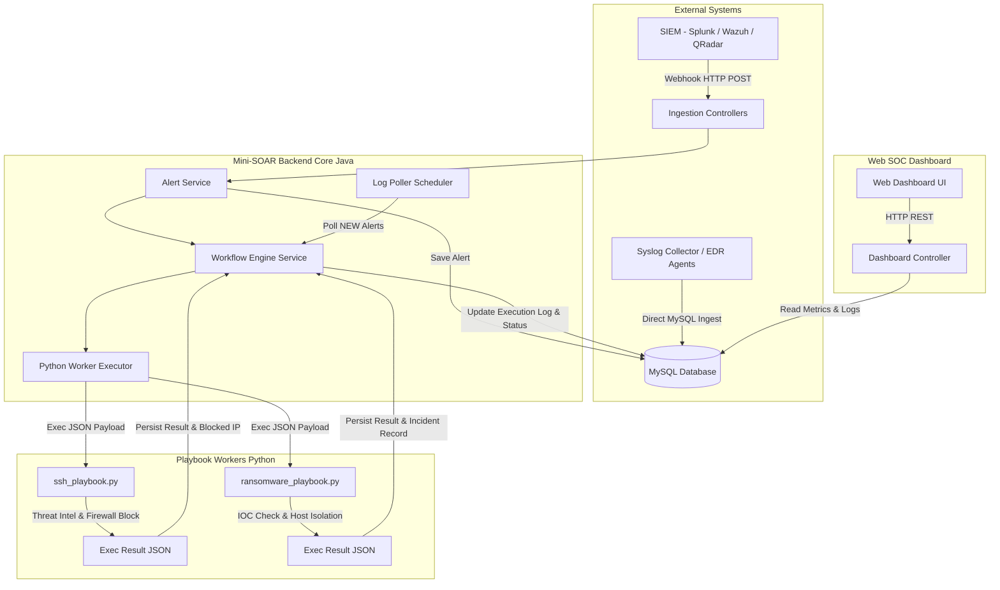
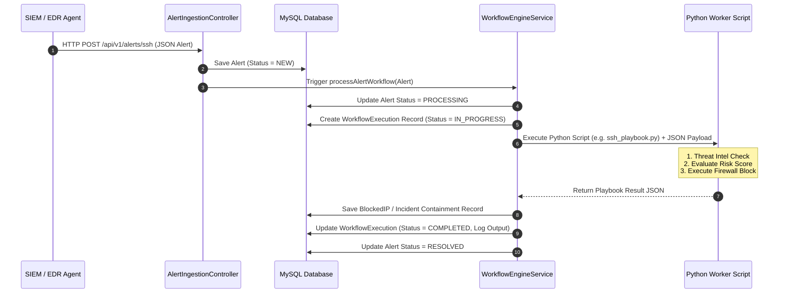

# Tài liệu Kiến trúc Hệ thống (System Architecture Document - SAD)
## Mini-SOAR Security Automation Platform

---

## 1. Tổng quan Kiến trúc (High-Level Architecture)

**Mini-SOAR Security Automation Platform** là hệ thống tự động hóa phản ứng sự cố an ninh mạng (Security Orchestration, Automation, and Response), được thiết kế theo mô hình kiến trúc vi dịch vụ (Microservices-friendly / Modular Architecture):

- **Core Orchestrator (Java 21 / Spring Boot 3)**: Đóng vai trò là trung tâm tiếp nhận sự cố, điều phối quy trình (Workflow Engine) và quản lý trạng thái.
- **Automation Workers (Python 3)**: Đóng vai trò là các Playbook Executable Scripts thực hiện phân tích chuyên sâu, chấm điểm nguy cơ và đưa ra các hành động ngăn chặn (Block IP, Terminate Process, Isolate Host).
- **Database Layer (MySQL 8.0)**: Lưu trữ tập trung dữ liệu Cảnh báo (Alerts), Lịch sử thực thi Playbook (Workflow Executions) và Danh sách ngăn chặn (Blocked IPs, Ransomware Incidents).
- **Presentation Layer (HTML5 / Bootstrap 5 / JS)**: Giao diện giám sát Web SOC Dashboard trực quan.

---

## 2. Chu trình Xử lý Sự cố (Incident Execution Sequence)

Tài liệu thể hiện chu trình xử lý sự cố từ lúc sự cố phát sinh cho đến khi hoàn thành ứng cứu tự động:

---

## 3. Thành phần Chi tiết (Component Breakdown)

| Thành phần | Công nghệ | Vai trò / Chức năng |
| :--- | :--- | :--- |
| **AlertIngestionController** | Java Spring Boot REST | Tiếp nhận Webhook API từ SIEM/EDR. Kiểm tra dữ liệu đầu vào (Validation). |
| **WorkflowEngineService** | Java Spring Boot Service | Router điều phối Playbook phù hợp với loại sự cố, xử lý kết quả và lưu Audit Log. |
| **PythonWorkerExecutorService**| Java ProcessBuilder | Kích hoạt script Python bằng ProcessBuilder, bắt luồng stdout/stderr và quản lý timeout. |
| **LogPollerScheduler** | Spring `@Scheduled` | Quét bảng `alerts` trong MySQL định kỳ 15s để xử lý các cảnh báo chèn trực tiếp vào DB. |
| **ssh_playbook.py** | Python 3 | Playbook xử lý tấn công SSH Brute-force: Kiểm tra IP, chặn Firewall, bắn thông báo. |
| **ransomware_playbook.py** | Python 3 | Playbook xử lý Ransomware: Dừng PID tiến trình độc hại, cô lập máy chủ khỏi mạng. |
| **MySQL Database** | MySQL 8.0 Server | CSDL quan hệ lưu giữ vết toàn bộ sự cố, quy trình ứng cứu và dữ liệu an ninh. |
| **Web SOC Dashboard** | HTML5 / Bootstrap 5 / JS | Màn hình trung tâm hiển thị chỉ số, danh sách sự cố và công cụ giả lập bắn alert. |
