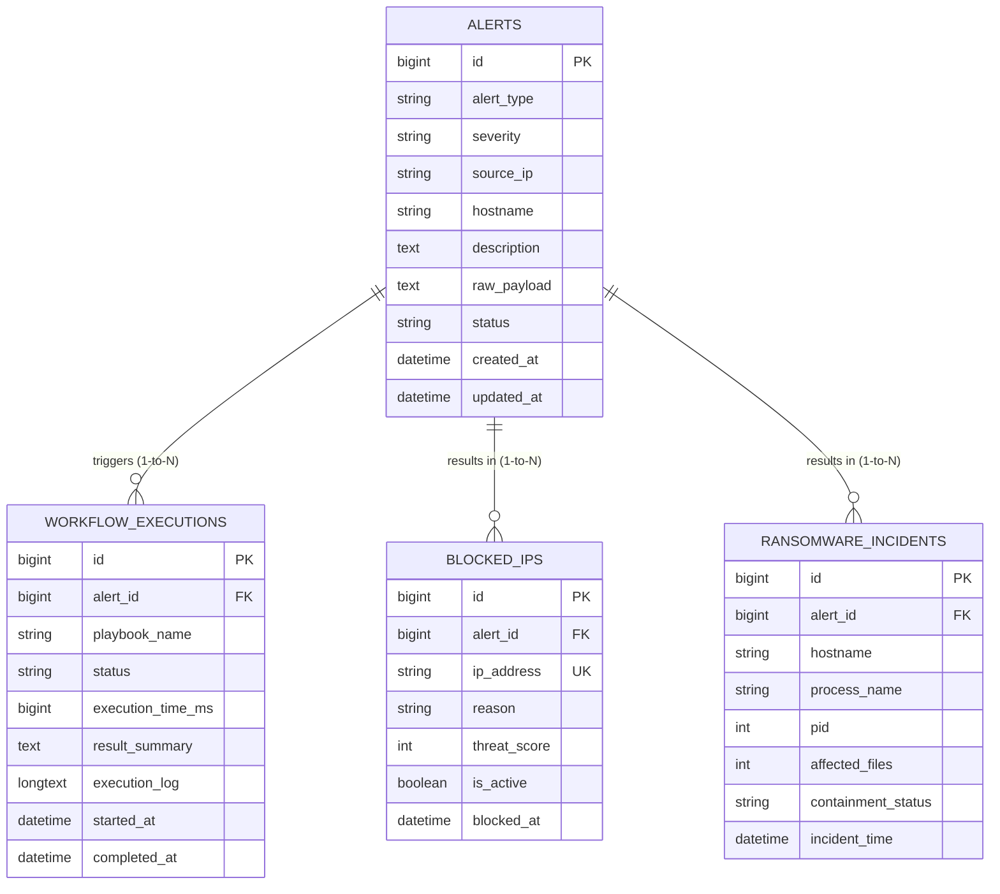

# Thiết kế CSDL & Sơ đồ Bảng Database (Database Schema & ERD)
## Mini-SOAR Security Automation Platform

---

## 1. Tổng quan CSDL MySQL (Overview)

- **Database Name**: `mini_soar_db`
- **Engine**: InnoDB
- **Default Character Set**: `utf8mb4`
- **Collation**: `utf8mb4_unicode_ci`

---

## 2. Sơ đồ Quan hệ Bảng (Entity-Relationship Diagram - ERD)



---

## 3. Chi tiết Cấu trúc các Bảng Dữ liệu (Table Definitions)

### 3.1. Bảng `alerts` (Quản lý Cảnh báo an ninh tiếp nhận)
Lưu trữ toàn bộ các cảnh báo an ninh được tiếp nhận từ các nguồn (Webhook API, SIEM, Syslog, EDR).

| Tên trường | Kiểu dữ liệu | Ràng buộc | Mô tả |
| :--- | :--- | :--- | :--- |
| `id` | BIGINT | PRIMARY KEY, AUTO_INCREMENT | Khóa chính tự tăng |
| `alert_type` | VARCHAR(32) | NOT NULL | Loại cảnh báo (`SSH_BRUTEFORCE`, `RANSOMWARE_DETECTION`) |
| `severity` | VARCHAR(16) | NOT NULL | Mức độ nghiêm trọng (`LOW`, `MEDIUM`, `HIGH`, `CRITICAL`) |
| `source_ip` | VARCHAR(45) | NULLABLE | IP kẻ tấn công (IPv4/IPv6) |
| `hostname` | VARCHAR(128) | NOT NULL | Tên máy chủ / máy trạm bị ảnh hưởng |
| `description` | TEXT | NULLABLE | Mô tả chi tiết cảnh báo |
| `raw_payload` | TEXT | NOT NULL | Dữ liệu thô dạng JSON tiếp nhận ban đầu |
| `status` | VARCHAR(32) | NOT NULL, DEFAULT 'NEW' | Trạng thái (`NEW`, `PROCESSING`, `RESOLVED`, `FAILED`) |
| `created_at` | DATETIME | NOT NULL, DEFAULT CURRENT_TIMESTAMP | Thời điểm tạo cảnh báo |
| `updated_at` | DATETIME | NOT NULL, ON UPDATE CURRENT_TIMESTAMP | Thời điểm cập nhật cuối cùng |

- **Indexes**: `idx_alert_type (alert_type)`, `idx_status (status)`, `idx_created_at (created_at)`

---

### 3.2. Bảng `workflow_executions` (Lịch sử thực thi Playbook)
Lưu vết chi tiết nhật ký thực thi của các script Python Playbook Worker.

| Tên trường | Kiểu dữ liệu | Ràng buộc | Mô tả |
| :--- | :--- | :--- | :--- |
| `id` | BIGINT | PRIMARY KEY, AUTO_INCREMENT | Khóa chính tự tăng |
| `alert_id` | BIGINT | FOREIGN KEY (`alerts.id`) | Mã sự cố tương ứng |
| `playbook_name` | VARCHAR(64) | NOT NULL | Tên file Playbook script (vd: `ssh_playbook.py`) |
| `status` | VARCHAR(32) | NOT NULL | Trạng thái thực thi (`IN_PROGRESS`, `COMPLETED`, `FAILED`) |
| `execution_time_ms` | BIGINT | NULLABLE | Thời gian thực thi tính bằng miligiây (ms) |
| `result_summary` | TEXT | NULLABLE | Tóm tắt kết quả xử lý |
| `execution_log` | LONGTEXT | NULLABLE | Toàn bộ log stdout/stderr dạng JSON từ Python |
| `started_at` | DATETIME | NOT NULL | Thời điểm bắt đầu chạy |
| `completed_at` | DATETIME | NULLABLE | Thời điểm kết thúc chạy |

- **Indexes**: `idx_alert_id (alert_id)`, `idx_exec_status (status)`

---

### 3.3. Bảng `blocked_ips` (Danh sách IP bị chặn Firewall)
Lưu danh sách các IP đã bị tự động chặn bởi Playbook SSH.

| Tên trường | Kiểu dữ liệu | Ràng buộc | Mô tả |
| :--- | :--- | :--- | :--- |
| `id` | BIGINT | PRIMARY KEY, AUTO_INCREMENT | Khóa chính tự tăng |
| `alert_id` | BIGINT | FOREIGN KEY (`alerts.id`) | Mã sự cố liên quan |
| `ip_address` | VARCHAR(45) | UNIQUE, NOT NULL | Địa chỉ IP bị chặn |
| `reason` | VARCHAR(255) | NOT NULL | Lý do chặn |
| `threat_score` | INT | NOT NULL, DEFAULT 0 | Điểm rủi ro (0 - 100) |
| `is_active` | BOOLEAN | NOT NULL, DEFAULT TRUE | Trạng thái hiệu lực của quy tắc chặn |
| `blocked_at` | DATETIME | NOT NULL | Thời điểm chặn |

---

### 3.4. Bảng `ransomware_incidents` (Nhật ký Cô lập Ransomware)
Lưu thông tin các sự cố Ransomware đã được khoanh vùng & cô lập.

| Tên trường | Kiểu dữ liệu | Ràng buộc | Mô tả |
| :--- | :--- | :--- | :--- |
| `id` | BIGINT | PRIMARY KEY, AUTO_INCREMENT | Khóa chính tự tăng |
| `alert_id` | BIGINT | FOREIGN KEY (`alerts.id`) | Mã sự cố liên quan |
| `hostname` | VARCHAR(128) | NOT NULL | Máy bị lây nhiễm mã độc |
| `processName` | VARCHAR(128) | NOT NULL | Tên tiến trình gây hại bị diệt |
| `pid` | INT | NOT NULL | Process ID bị diệt |
| `affected_files` | INT | DEFAULT 0 | Số file bị ảnh hưởng |
| `containment_status` | VARCHAR(64) | NOT NULL | Trạng thái cô lập (`PROCESS_KILLED_AND_HOST_ISOLATED`) |
| `incident_time` | DATETIME | NOT NULL | Thời điểm xử lý sự cố |

---

## 4. Chính sách Bảo trì & Xóa Log tự động (Data Retention Policy)

Để tránh tình trạng tràn dung lượng đĩa cứng do dữ liệu `execution_log` (LONGTEXT) phình to theo thời gian:
- **Alerts & Executions**: Khuyên dùng chạy Scheduled Event trên MySQL tự động lưu trữ (Archive) hoặc xóa dữ liệu cũ quá **90 ngày**:
  ```sql
  DELETE FROM alerts WHERE created_at < NOW() - INTERVAL 90 DAY;
  ```
