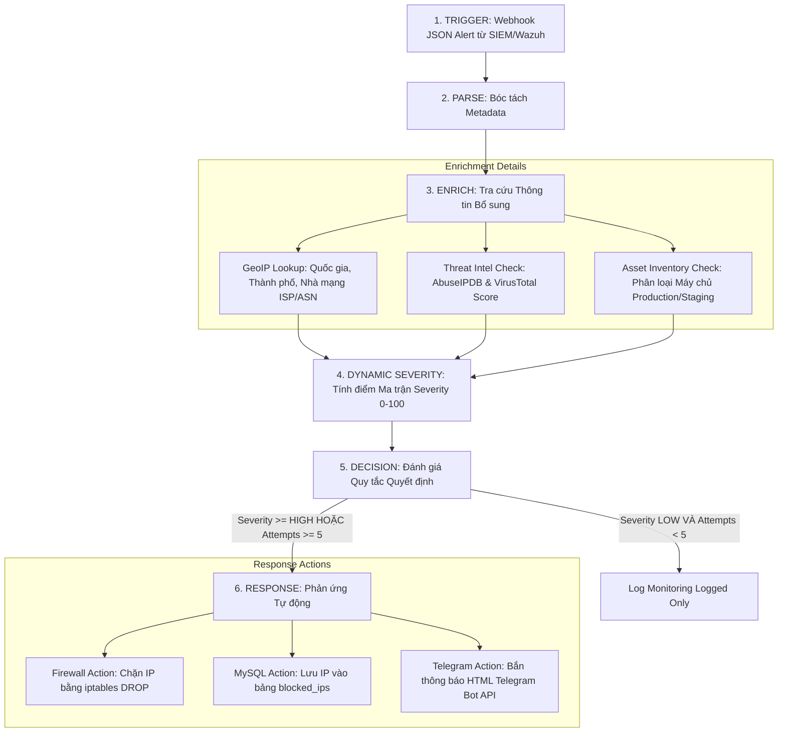
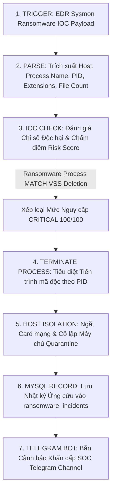

# Tài liệu Kịch bản Quy trình Playbook Runbook Chi tiết
## Mini-SOAR Security Automation Platform

Tài liệu đặc tả toàn bộ quy trình vận hành tự động của **2 Playbooks chính** được xây dựng trong hệ thống Mini-SOAR:
1. **`python_workers/ssh_playbook.py`**: Playbook Xử lý Tấn công SSH Brute-Force (Chuẩn 5 Giai đoạn & Telegram Bot).
2. **`python_workers/ransomware_playbook.py`**: Playbook Cô lập Khẩn cấp Mã độc Ransomware (Tiêu diệt PID & Cách ly Mạng).

---

## 1. PLAYBOOK 1: SSH ATTACK RESPONSE (`python_workers/ssh_playbook.py`)

### 🎯 1.1. Mục tiêu & Phạm vi
Tự động hóa hoàn toàn quy trình ứng cứu tấn công rà quét/dò mật khẩu SSH từ khi nhận cảnh báo SIEM, bóc tách dữ liệu, tra cứu uy tín IP, tính toán điểm Severity động, tự động chặn IP trên Firewall và phát thông báo tới kênh Telegram của đội SOC.

### ⚙️ 1.2. Luồng Quy trình 5 Giai đoạn (5-Stage SOAR Pipeline)



---

### 🧮 1.3. Ma trận Tính điểm Severity Động (Dynamic Severity Matrix)

Tổng điểm Severity $TotalScore \in [0, 100]$ được tính theo công thức:
$$TotalScore = \min(100, \text{Trọng số Thử sai} + \text{Trọng số Threat Intel} + \text{Trọng số Tài sản})$$

#### Chi tiết Trọng số:
1. **Trọng số Tần suất Thử sai (`failed_attempts`)**:
   - `failed_attempts` $< 3$: 10 điểm.
   - $3 \le$ `failed_attempts` $< 5$: 25 điểm.
   - `failed_attempts` $\ge 5$: 40 điểm.
2. **Trọng số Threat Intel (Uy tín IP)**:
   - Nếu là **Private IP Nội bộ** (`192.168.x`, `10.x`): **0 điểm**.
   - Nếu là **Public IP ngoài Internet**: $\text{ThreatScore} \times 0.35$ (Tối đa 35 điểm).
3. **Trọng số Tầm quan trọng Tài sản (Asset Criticality)**:
   - Máy chủ **PRODUCTION / Database (`srv-prod-ssh01`)**: **30 điểm**.
   - Máy chủ STAGING (`srv-stage-01`): **15 điểm**.
   - Máy chủ DEV / Local (`srv-dev-01`): **5 điểm**.

#### Thang Phân loại Severity:
- $TotalScore \ge 85$: 🔴 **`CRITICAL`**
- $65 \le TotalScore < 85$: 🟠 **`HIGH`**
- $40 \le TotalScore < 65$: 🟡 **`MEDIUM`**
- $TotalScore < 40$: 🟢 **`LOW`**

---

### 📲 1.4. Mẫu Thông báo Telegram Bot Trả về
```html
🚨 [MINI-SOAR ALERT] CẢNH BÁO TẤN CÔNG SSH

• Mức độ Nguy hiểm: HIGH (78/100)
• Máy chủ Mục tiêu: srv-prod-ssh01 (PRODUCTION)
• Tài khoản Bị nhắm tới: root
• IP Tấn công: 203.0.113.195 (Netherlands - Hostinger International)
• Số lần thử sai: 8 lần
• Hành động Phản ứng: ⛔ CHẶN IP FIREWALL (iptables DROP)

⏰ Thời gian: 2026-08-22 09:34:16
```

---

## 2. PLAYBOOK 2: RANSOMWARE EMERGENCY CONTAINMENT (`python_workers/ransomware_playbook.py`)

### 🎯 2.1. Mục tiêu & Phạm vi
Ứng cứu khẩn cấp khi hệ thống EDR / Endpoint Security phát hiện tiến trình độc hại xóa bản sao lưu hệ thống (Shadow Copy / VSS) và mã hóa dữ liệu hàng loạt. Ngăn chặn triệt để lây nhiễm chéo sang các máy chủ khác (Lateral Movement).

### ⚙️ 2.2. Luồng Quy trình Thực thi Khẩn cấp



---

### 🔍 2.3. Danh mục Kiểm tra Chỉ số Độc hại (IOC Blacklist Check)

1. **Blacklist Tiến trình Mã độc (Process Blacklist)**:
   - `vssadmin.exe` (Lệnh xóa bản sao lưu Volume Shadow Copy).
   - `wbadmin.exe`, `bcdedit.exe` (Xóa cấu hình boot recovery).
   - `wannacry.exe`, `lockbit.exe`, `encryptor.py`, `ransom.exe`.
2. **Blacklist Đuôi File Mã hóa (Extension Blacklist)**:
   - `.locked`, `.crypto`, `.enc`, `.lockbit`, `.wnry`, `.crypted`.
3. **Ngưỡng Biến đổi File**: Số lượng file bị đổi đuôi $> 50$ file/phút.

---

### 🛡️ 2.4. Chi tiết 2 Hành động Cô lập Khẩn cấp (Containment Actions)

1. **Hành động 1 - Forceful Process Termination**:
   - Thực thi lệnh ngắt khẩn cấp tiến trình độc hại theo PID:
     - Trên Linux: `kill -9 <PID>`
     - Trên Windows: `taskkill /F /PID <PID>`
2. **Hành động 2 - Host Network Isolation (Quarantine)**:
   - Vô hiệu hóa card mạng của máy bị lây nhiễm hoặc chuyển VLAN sang dải Quarantine để ngắt toàn bộ luồng mạng ra bên ngoài.
   - Ghi bản ghi vết ứng cứu vào bảng `ransomware_incidents` trong MySQL với trạng thái `PROCESS_KILLED_HOST_ISOLATED_TELEGRAM_ALERT`.

---

### 📲 2.5. Mẫu Thông báo Telegram Bot Khẩn cấp Trả về
```html
☣️ [CRITICAL RANSOMWARE INCIDENT] ỨNG CỨU MÃ ĐỘC KHẨN CẤP

• Mức độ Nguy hiểm: 🔴 CRITICAL (100/100)
• Máy chủ Bị lây nhiễm: ws-finance-04
• Tiến trình Độc hại (PID): vssadmin.exe (PID: 5120)
• Số file bị mã hóa: 480 tệp
• Đuôi file bị đổi: .locked, .crypto, .wnry

🛡️ HÀNH ĐỘNG TỰ ĐỘNG ĐÃ THỰC THI:
1. ⚔️ Đã diệt tiến trình mã độc PID 5120 (Process Terminated)
2. 🔒 Đã ngắt card mạng & cô lập máy chủ ws-finance-04 (Host Network Isolated)

⏰ Thời gian xử lý: 2026-08-22 09:34:21
```

---

## 3. Tổng hợp Bảng so sánh 2 Playbooks

| Tiêu chí | SSH Attack Response Playbook | Ransomware Containment Playbook |
| :--- | :--- | :--- |
| **File Script** | `python_workers/ssh_playbook.py` | `python_workers/ransomware_playbook.py` |
| **Nguồn Cảnh báo** | SIEM / Wazuh / Syslog | EDR Agents / Sysmon Event Logs |
| **Cơ chế Đánh giá** | Ma trận 3 yếu tố (Attempts + Threat Intel + Asset) | Đánh giá IOC Tiến trình & Tốc độ Mã hóa File |
| **Mức Severity** | `LOW` $\rightarrow$ `CRITICAL` | Luôn là `CRITICAL` (100/100) |
| **Hành động Phản ứng 1**| Chặn IP trên Firewall (`iptables DROP`) | Diệt tiến trình độc hại theo PID (`kill -9`) |
| **Hành động Phản ứng 2**| Thêm IP vào Blacklist MySQL (`blocked_ips`)| Cô lập card mạng máy tính (Network Quarantine) |
| **Kênh Thông báo** | Telegram Bot API (`sendMessage`) | Telegram Bot API (`sendMessage` khẩn cấp) |
